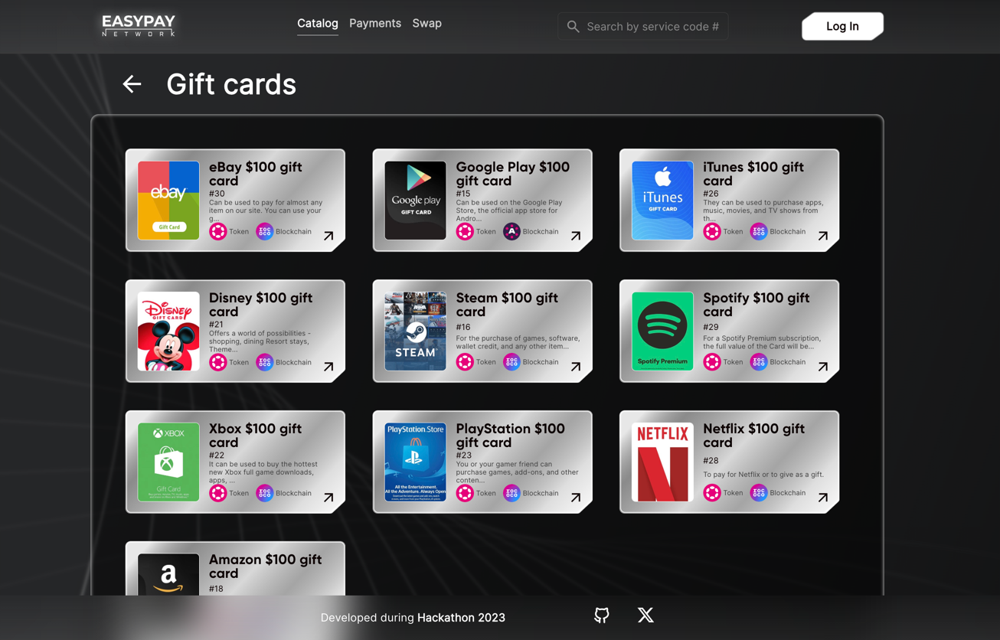
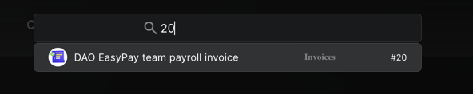

# POLKADOT-CHAMPIONSHIP-2023

## During the hackathon, we FORKED the project, improved it, and integrated it with Polkadot, enabling flexible payroll for DAOs.

> **Boost blockchain economy to the new level by eliminating user fragmentation, enhancing liquidity, and unifying markets across the entire web3!**

* [easypay.network](https://easypay.network) - a web-site/dapp that clearly shows how you can work with EasyPay Network.
* [github.com/easypay-network/POLKADOT-CHAMPIONSHIP-2023](https://github.com/easypay-network/POLKADOT-CHAMPIONSHIP-2023) - github project repository, which contains all the developments of this project during **Hackathon 2023**.

<blockquote style="font-style: italic;"> We want to emphasize that the code developed for the hackathon was a rapid prototype, created with a focus on showcasing the concept. While it effectively served its purpose for the hackathon, it should be noted that it is not intended for production use. It was a quick and functional demonstration of our ideas, and as we move forward, we will build a production-ready solution from the ground up.
</blockquote>

## Content
* [Content](#Content)
* [Interface](#Interface)
* [Architecture](#Architecture)
* [Database](#Database)
* [Protocol](#Protocol)
* [Repositories](#Repositories)

## Interface

### Catalog
CATEGORIES                          |  ITEMS MINI                         |  ITEMS DETAILED                     |
:----------------------------------:|:-----------------------------------:|:-----------------------------------:|
  |   |  |
|                                   |   |  |

### Login
NO ONE                              |  ALL                                |
:----------------------------------:|:-----------------------------------:|
  |   |

### Swap
INITIAL PAGE                        |  PATH EXAMPLE                        |
:----------------------------------:|:------------------------------------:|
  |    |
|                                   |                                      |

### PAYMENT BY SERVICE CODE & REFERENCE NUMBER
SEARCH OPTIONS                      |  FINDED ITEM                         |
:----------------------------------:|:------------------------------------:|
 |   |

### REPORTS
TYPES                                |  TIMELINE                            | STUB                                |
:-----------------------------------:|:------------------------------------:|:-----------------------------------:|
  |   |  |

### INVOICES
CONSTRUCTOR                          |  LIST                                | DETAILS                             | PAYMENT                             |
:-----------------------------------:|:------------------------------------:|:-----------------------------------:|:-----------------------------------:|
  |   |  |  |

### INVOICE PAYMENT
PAYMENT TOKEN SELECTION              |REQUIREMENTS                         |
:-----------------------------------:|:-----------------------------------:|
  |  |

## Architecture

## Database

> **Graph database Neo4j with pathfinding algorithm**

## Protocol

## Repositories

* [easypay-network/POLKADOT-CHAMPIONSHIP-2023](https://github.com/easypay-network/POLKADOT-CHAMPIONSHIP-2023) - EasyPay Network project root documentation repository
* [easypay-network/polkadot-hackathon-frontend](https://github.com/easypay-network/polkadot-hackathon-frontend) - dApp for interacting with our EasyPay Network Payment System.
* [easypay-network/polkadot-hackathon-server](https://github.com/easypay-network/polkadot-hackathon-server) - server-side component that connects the graph database and the pathfinder with the frontend client. This component handles the core business logic, ensuring that transactions are executed seamlessly and securely.
* [easypay-network/polkadot-hackathon-database](https://github.com/easypay-network/polkadot-hackathon-database) - cypher scripts for neo4j database. Our pathfinder algorithm was designed to find routes in the graph database based on the user's chosen payment token and the token required for payment. This component plays a crucial role in ensuring smooth cross-chain transactions.
